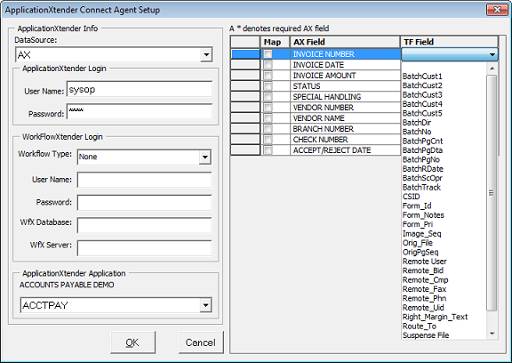


If you have upgraded ApplicationXtender to 6.5 or above and found that the included export for TeleForm no longer works, fear not, we have a supported replacement. It requires that the ApplicationXtender document manager be installed on the TeleForm workstation (Reader and Designer) and uses the supported AX API. If you would like more information, please leave a comment or call us at <a href="tel:+14809706900">480-970-6900</a>, select the option for Tech Support and a TeleForm/ApplicationXtender expert will be happy to help.

